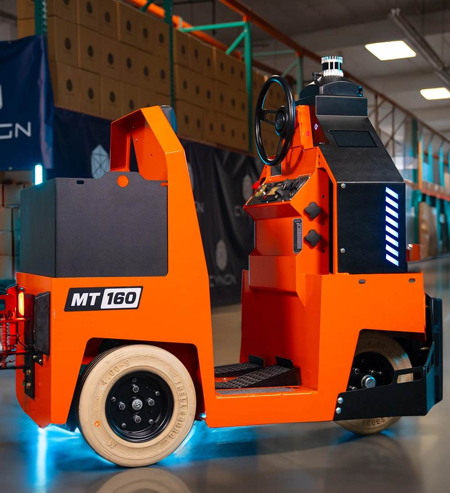
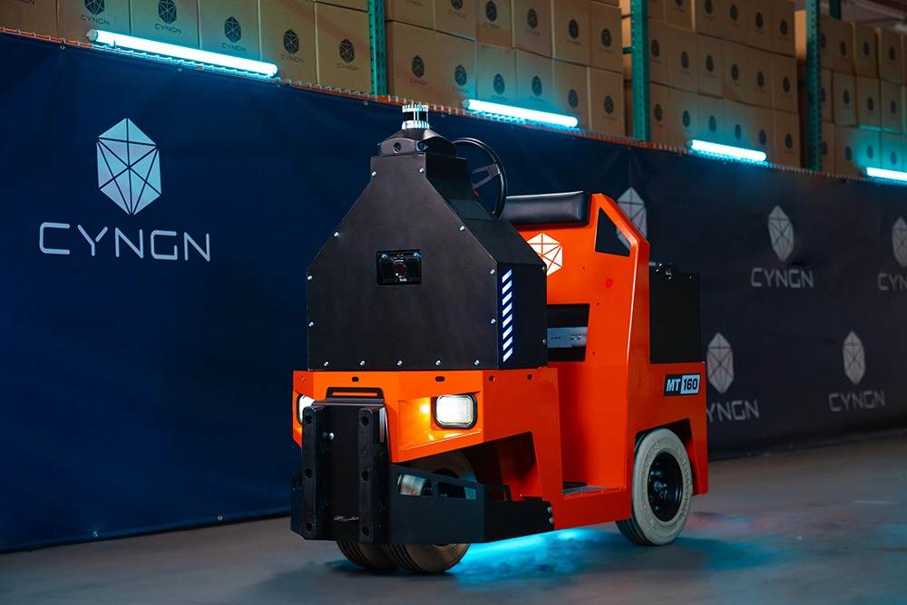

<!DOCTYPE html>
<html lang="en">
<head>
<meta charset="UTF-8">
<meta name="viewport" content="width=device-width, initial-scale=1.0">
<title>Meet Pally — Your AI tugger for any situation | Cyngn (concept)</title>

<!-- Concept demo metadata -->
<meta name="description" content="Concept homepage redesign for Cyngn (NASDAQ: CYN) DriveMod Tugger — single-product hero with embedded configurator. Portfolio asset by Nizam Ali. Not affiliated with Cyngn Inc.">
<meta name="author" content="Nizam Ali">
<meta name="robots" content="noindex">

<!-- Open Graph -->
<meta property="og:type" content="website">
<meta property="og:title" content="Meet Pally — concept homepage for Cyngn DriveMod Tugger">
<meta property="og:description" content="Single-product hero. Named character. Configurator-driven funnel. A concept by Nizam Ali for the Cyngn Head of RevOps role. Not affiliated with Cyngn Inc.">

<!-- Twitter -->
<meta name="twitter:card" content="summary">
<meta name="twitter:title" content="Meet Pally — Your AI tugger for any situation">
<meta name="twitter:description" content="Concept homepage redesign by Nizam Ali. Not affiliated with Cyngn Inc.">

<!-- Favicon (Cyngn-style orange C mark) -->
<link rel="icon" type="image/svg+xml" href="data:image/svg+xml,%3Csvg xmlns='http://www.w3.org/2000/svg' viewBox='0 0 32 32'%3E%3Crect width='32' height='32' rx='6' fill='%23FF5F1F'/%3E%3Ctext x='16' y='23' text-anchor='middle' font-family='Arial Black,sans-serif' font-weight='900' font-size='20' fill='white'%3EC%3C/text%3E%3C/svg%3E">
<link rel="preconnect" href="https://fonts.googleapis.com">
<link rel="preconnect" href="https://fonts.gstatic.com" crossorigin>
<link href="https://fonts.googleapis.com/css2?family=Archivo:wght@400;500;600;700;800;900&family=Fraunces:ital,opsz,wght@0,9..144,400;0,9..144,500;0,9..144,600;0,9..144,700;0,9..144,800;0,9..144,900;1,9..144,400;1,9..144,700&family=Manrope:wght@300;400;500;600;700&family=JetBrains+Mono:wght@400;500;700&display=swap" rel="stylesheet">

</head>
<body>

<!-- ============ NAV ============ -->
<nav>
  

    <a href="#" class="logo">
      <svg class="logo-mark-svg" viewBox="0 0 32 32" xmlns="http://www.w3.org/2000/svg" aria-hidden="true">
        <!-- Stylized Cyngn-style geometric diamond mark -->
        <polygon points="16,3 27,10 27,22 16,29 5,22 5,10" fill="none" stroke="#FF5F1F" stroke-width="2.4" stroke-linejoin="round"/>
        <polygon points="16,9 22,12.5 22,19.5 16,23 10,19.5 10,12.5" fill="#FF5F1F"/>
      </svg>
      

        
pally

        
by Cyngn · NASDAQ: CYN

      

    </a>
    <ul class="nav-links">
      <li><a href="#meet">Meet Pally</a></li>
      <li><a href="#specs">Specs</a></li>
      <li><a href="#compare">vs. AGVs</a></li>
      <li><a href="#math">The math</a></li>
      <li><a href="#references">Deployments</a></li>
      <li><a href="#faq">FAQ</a></li>
    </ul>
    

      <a href="#" class="nav-cta-secondary">Sign in</a>
      <a href="#configurator" class="nav-cta-primary">Configure pilot →</a>
    

  

</nav>

<!-- ============ HERO ============ -->
<section class="hero">
  

    

      
DriveMod-enabled · Built on Motrec MT-160

      <h1 class="hero-title reveal reveal-3">
        Meet Pally. 
        Your AI Tugger.
      </h1>

      

        Pally hauls up to <strong>12,000 lbs</strong> indoors and out — handling the predictable, repeatable transport runs while your team focuses on machining, picking, and quality.
      

      

        

          
12,000lb

          
Tow capacity

        

        

          
+33%

          
Productivity / shift

        

        

          
−64%

          
Labor cost / route

        

        

          
18mo

          
Avg. payback

        

      

      

        
Deployed today at

        

          G&amp;J Pepsi
          DHL
          Coats
          Vann Family Orchards
          U.S. Continental
          Arauco
        

      

      

        <a href="#configurator" class="hero-cta-primary">Configure your pilot ↓</a>
        <a href="#meet" class="hero-cta-secondary">Learn more about Pally</a>
      

    

    

      
    

  

</section>

<!-- ============ CONFIGURATOR (full-width band) ============ -->
<section id="configurator" class="config-band">
  

    

      

        
→ Pilot configurator

        <h2 class="config-band-title">Configure your DriveMod pilot in 60 seconds.</h2>
        
Five questions. We'll generate a customer-specific ROI estimate and route a real solutions engineer to follow up within 24 hours.

      

      

        

          

            

              
→ Pilot configurator

              
Tell us about your operation

            

          

          

            Q&nbsp;<strong id="stepNum">1</strong>&nbsp;of&nbsp;5
          

        

        

          

        

        

          <!-- Dynamic content -->
        

      

    

  

</section>

<!-- ============ MEET PALLY (PRODUCT OVERVIEW) ============ -->
<section id="meet" class="section resume-section">
  

    
→ Meet Pally

    <h2 class="section-title">The autonomous tugger, built on a proven industrial chassis.</h2>
    
Pally is what happens when Cyngn's DriveMod autonomy stack runs on the Motrec MT-160 — the stand-up tow tractor used in casinos, manufacturing plants, and distribution centers across North America for over a decade. Real OEM hardware, real autonomy IP, deployed alongside the team you already have.

    

      

        

          
          
Pally

          
Autonomous tow tractor · 12,000 lb capacity

          
DriveMod autonomy on the Motrec MT-160 chassis. Indoor and outdoor. WMS-integrated. Zero infrastructure required.

        

      

      

        

          <h3>What Pally does</h3>
          
Pally automates predictable, repeatable material transport — the runs between machining and warehouse storage, between buildings, between zones in connected facilities. It tows up to 12,000 lbs across multi-cart trains, runs continuously across all three shifts, and reroutes in real time based on WMS-dispatched missions.

          
Cyngn's CEO Lior Tal frames it directly: "DriveMod handles predictable, repeatable movement, while forklifts and skilled labor stay focused on machining and warehouse operations." U.S. Continental absorbed roughly 200 forklift trips per week. Coats unlocked 500+ labor hours at their 150K sq ft Tennessee facility. WEG Electric Motor automated 60 pallets per day at their Bluffton, Indiana plant.

        

        

          <h3>How Pally is built</h3>
          
The chassis is the Motrec MT-160 — a 30" stand-up tow tractor with a 15 HP brushless AC motor, regenerative braking, and a decade of industrial deployment behind it. The autonomy stack is Cyngn's DriveMod: 3D LiDAR perception, 3D semantic mapping, predictive trajectory tracking for pedestrian safety, and patented motion compensation (U.S. Patent No. 12,032,099).

          
Real OEM hardware, real autonomy IP. No retrofit project, no integration risk, no "phase two" that never ships.

        

        

          <h3>Where Pally works</h3>
          
Indoor and outdoor environments, including transitions between buildings. Minimum aisle width of 55". Operates on facility maps generated during initial deployment — no magnetic strips, no QR markers, no infrastructure modifications. Three control surfaces: on-vehicle HMI, cloud FMS (Cyngn Insight), and tablet stations placed throughout the facility.

          
Currently deployed across food &amp; beverage, agriculture, manufacturing, and logistics. Hardware platform manufactured by Motrec in Quebec, Canada.

        

        

          <h3>What Pally costs</h3>
          
Capex purchase or financed structure. Cyngn customer benchmarks show an average payback period of 18 months and 64% reduction in direct labor cost per route. Detailed pricing depends on fleet size, deployment scope, financing structure, and facility complexity — the configurator above generates a customer-specific estimate.

        

        

          <h3>How long it takes</h3>
          
Roughly <strong>90 days</strong> from offer letter to first shift on the floor. Two weeks for facility assessment and ROI modeling. Four to six weeks for vehicle integration and shipping. Two to four weeks for on-site mapping, WMS integration, and operator training. No facility shutdown required at any phase.

        

      

    

  

</section>

<!-- ============ TECHNICAL SPECS ============ -->
<section id="specs" class="section specs-section">
  

    
→ Technical specifications

    <h2 class="section-title">The datasheet.</h2>
    
For the plant engineers, procurement teams, and integrators who need real numbers before forwarding this to operations leadership.

    

      

        <h4>Vehicle &amp; Platform</h4>
        

          Hardware platform
          Motrec MT-160
        

        

          Train towing capacity
          <strong>up to 12,000 lbs</strong>
        

        

          Vehicle width
          30 inches
        

        

          Minimum aisle width
          55 inches
        

        

          Max speed
          6 mph (configurable)
        

        

          Motor
          15 HP 48V brushless AC
        

        

          Power options
          Lithium-ion or lead-acid
        

        

          Braking
          Regenerative + drum + parking
        

        

          Operating environment
          Indoor + outdoor
        

      

      

        <h4>Autonomy &amp; Control</h4>
        

          Perception
          3D LiDAR + multi-layer
        

        

          Localization
          3D semantic map
        

        

          Infrastructure required
          <strong>None</strong>
        

        

          Operating modes
          Autonomous + manual
        

        

          Cart compatibility
          Any cart, quad-steer preferred
        

        

          Control interfaces
          On-vehicle HMI, cloud FMS, tablets
        

        

          Fleet management
          Cyngn Insight
        

        

          Safety system
          2× e-stop, LED status, audio cues
        

        

          Patented technology
          U.S. Patent No. 12,032,099
        

      

    

    

      Source: Motrec MT-160 product specifications · Cyngn DriveMod Tugger FAQ &amp; spec sheet (cyngn.com) · USPTO patent records
    

  

</section>

<!-- ============ PALLY VS TRADITIONAL AGVs ============ -->
<section id="compare" class="section compare-section">
  

    
→ How Pally compares

    <h2 class="section-title">Pally vs. the AGV you almost bought.</h2>
    
If you're evaluating Pally against traditional Automated Guided Vehicles — Seegrid, Otto, Vecna, MiR, Locus, Geek+ — these are the differences that matter to a 5-year capex decision.

    <table class="compare-table">
      <thead>
        <tr>
          <th>Capability</th>
          <th>Traditional AGV</th>
          <th class="pally-col">Pally (Cyngn DriveMod)</th>
        </tr>
      </thead>
      <tbody>
        <tr>
          <td class="dimension">Infrastructure</td>
          <td class="legacy">Magnetic strips, QR markers, beacons, or wire embedment</td>
          <td class="pally-col"><strong>None.</strong> 3D LiDAR navigation only.</td>
        </tr>
        <tr>
          <td class="dimension">Deployment timeline</td>
          <td class="legacy">4–6 months including facility prep and downtime</td>
          <td class="pally-col"><strong>~90 days</strong> from offer to first shift, no facility downtime</td>
        </tr>
        <tr>
          <td class="dimension">Route changes</td>
          <td class="legacy">Re-engineering: floor work, shutdown windows, integrator visits</td>
          <td class="pally-col">Software configuration update, no facility disruption</td>
        </tr>
        <tr>
          <td class="dimension">Pedestrian safety</td>
          <td class="legacy">Stop-on-contact or 2D obstacle detection</td>
          <td class="pally-col"><strong>Predictive trajectory tracking</strong> via 3D LiDAR — anticipates motion patterns</td>
        </tr>
        <tr>
          <td class="dimension">Map model</td>
          <td class="legacy">2D path-following</td>
          <td class="pally-col">3D semantic map — robust to dynamic environments</td>
        </tr>
        <tr>
          <td class="dimension">Cart compatibility</td>
          <td class="legacy">Vendor-specific carts often required</td>
          <td class="pally-col">Works with carts you already own</td>
        </tr>
        <tr>
          <td class="dimension">Mode flexibility</td>
          <td class="legacy">Autonomous-only — operator override is rare</td>
          <td class="pally-col">Manual mode at any time — driver takes over for edge cases</td>
        </tr>
        <tr>
          <td class="dimension">Mission orchestration</td>
          <td class="legacy">Pre-programmed paths, fixed sequences</td>
          <td class="pally-col">WMS-integrated dispatch, real-time mission re-routing</td>
        </tr>
      </tbody>
    </table>
  

</section>

<!-- ============ DAY IN THE LIFE ============ -->
<section id="day" class="section day-section">
  

    
→ A day with Pally

    <h2 class="section-title">An illustrative shift at a 100K sq ft facility.</h2>
    
A composite scenario based on Cyngn deployment patterns. Not a transcript from a single customer — a synthesized day-in-the-life to show what Pally's role looks like on the floor.

    

      

        
05:58

        

          
Pre-shift diagnostics complete at the charging dock

          
Battery at 98%. System checks pass. Pally is queued for first dispatch.

        

      

      

        
06:01

        

          
First mission picked up at staging

          
A 4,200 lb load of WIP material from receiving. Pally executes the dispatched route to assembly bay 3.

        

      

      

        
07:34

        

          
Pedestrian detected — autonomous stop &amp; resume

          
A forklift operator crosses the route. 3D LiDAR catches the trajectory at 8 meters out. Total stop duration: 4 seconds. The pedestrian doesn't break stride.

        

      

      

        
11:15

        

          
14 routes complete · 31,800 lb moved

          
Material movement across the facility continues uninterrupted while human operators take lunch. No break required.

        

      

      

        
14:22

        

          
WMS dispatches an unscheduled priority pull

          
Order changes upstream. The Cyngn Insight FMS reroutes Pally to expedite a hot order from finished goods to outbound. Mission complete in 11 minutes.

        

      

      

        
17:00

        

          
First shift ends · operations continue

          
Second-shift supervisor confirms the route plan via the tablet station — 30 seconds of human interaction. Continuous operation across the shift change.

        

      

      

        
22:47

        

          
Second shift complete · headed to dock

          
Total shift output: 89,400 lb moved across 38 routes. Average cart-cycle time 23% faster than the manual baseline from Q1.

        

      

      

        
23:15

        

          
Charging · diagnostics streaming to FMS

          
Ready for 05:58 dispatch tomorrow. Same configuration. Same reliability. Year over year.

        

      

    

  

</section>

<!-- ============ THE MATH ============ -->
<section id="math" class="section math-section">
  

    
→ The math

    <h2 class="section-title">Pally's hourly rate vs. the human you can't hire.</h2>
    
Year-one cost comparison for a single 24/7 tugger route. Conservative inputs. Numbers based on Cyngn customer ROI analyses.

    

      

        
Option A — Status quo

        
A human driver across 3 shifts

        

          

            Annual fully-loaded labor
            $165,000
          

          

            Avg. turnover replacement / yr
            ~$8,400
          

          

            Time off / sick / PTO coverage
            ~$12,000
          

          

            Safety incident reserve
            ~$6,500
          

          

            Productivity (% of theoretical)
            ~78%
          

          

            Year-one total
            $191,900
          

        

      

      
vs.

      

        
Option B — Deploy Pally

        
One Pally, same route, 24/7

        

          

            Capex (amortized year 1)
            ~$60,000
          

          

            Software + FMS subscription
            ~$9,000
          

          

            Energy + maintenance
            ~$3,400
          

          

            Safety incidents (LiDAR-protected)
            → 0
          

          

            Productivity (% of theoretical)
            ~96%
          

          

            Year-one total
            $72,400
          

        

      

    

    

      

        Net year-one savings: $119,500 per route 
        Payback in roughly 14 months. Compounding every year after.
      

    

    

      
Sources &amp; methodology

      
<strong>Annual labor cost ($165K / 24-7 facility):</strong> Calculated from BLS Occupational Employment and Wage Statistics, May 2024 — median annual wage for "Hand Laborers and Material Movers" of $37,680 (bls.gov/ooh). Fully loaded with employer payroll taxes, benefits, PTO, and turnover replacement costs (~1.45× multiplier ≈ $54,600/operator/shift). Three shifts × $54,600 ≈ $164,000.

      
<strong>33% productivity boost · 64% labor cost reduction · 18-month payback:</strong> Cyngn published metrics, sourced from Cyngn customer ROI analyses across deployed DriveMod Tugger installations (cyngn.com).

      
<strong>Capex / software / energy estimates:</strong> Illustrative inputs intended to demonstrate a customer-facing comparison framework. Customer-specific quotes will vary based on fleet size, deployment scope, financing structure, and facility complexity. Request your customer-specific ROI model below.

    

  

</section>

<!-- ============ REFERENCES ============ -->
<section id="references" class="section">
  

    
→ Customer deployments

    <h2 class="section-title">Already on the floor at production scale.</h2>
    
Six commercial deployments across food &amp; beverage, agriculture, manufacturing, and logistics. These aren't pilots — they're production fleets running shifts you don't have to staff.

    

      

        

          
U.S. Continental

          
Manufacturing

        

        
200 manual forklift trips per week, absorbed.

        
Before DriveMod, U.S. Continental's facility relied on roughly 200 forklift trips per week to handle pallet deliveries between two buildings. Pally automated the workload entirely, contributing to a 4× operational efficiency increase.

        
"I'd definitely recommend the DriveMod Tugger."

        
— Dave Hoover, VP of Technical Services, U.S. Continental

      

      

        

          
Coats

          
Manufacturing

        

        
500+ labor hours unlocked at 150K sq ft facility

        
Coats deployed DriveMod at their 150,000+ sq ft facility in La Vergne, Tennessee, automating wheel service component transport across production lines. The deployment freed 500+ labor hours for higher-judgment work.

        
"I wish we'd found it sooner."

        
— Steven Finley, VP of Operations, Coats

      

      

        

          
G&amp;J Pepsi

          
Beverage

        

        
#1 independent Pepsi bottler in the U.S.

        
DriveMod is deployed at G&amp;J Pepsi's 77,000 sq ft beverage distribution facility, automating high-frequency repetitive transport in a sector where labor turnover and seasonal demand swings hit hardest.

        
"By integrating Cyngn's DriveMod Tugger into our material handling processes, we're addressing today's labor challenges and positioning our business to meet the growing demands of tomorrow."

        
— Jeff Erwin, VP of Manufacturing &amp; Quality, G&amp;J Pepsi

      

      

        

          
Vann Family Orchards

          
Agriculture

        

        
4 Pallys deployed across processing facilities

        
Pally automates raw material transport between storage and processing zones across connected agricultural facilities. Hybrid workflow keeps humans on loading and product handling — where judgment matters most. Deployed via Chandler Automation, Cyngn's systems integration partner.

        
"DriveMod handles material transport between zones. Our team focuses on loading, picking, and quality. Right division of labor."

        
— Vann Family Orchards deployment, March 2026

      

    

  

</section>

<!-- ============ FAQ ============ -->
<section id="faq" class="section faq-section">
  

    
→ Pre-empted objections

    <h2 class="section-title">The questions that come up on every call.</h2>
    
Answered upfront, sourced from Cyngn's published documentation. If your question isn't here, the configurator routes it to a real solutions engineer.

    

      

        
01Do I need to change my warehouse infrastructure?

        
No. <strong>Pally uses 3D LiDAR perception and onboard intelligence</strong> — not magnetic strips, QR markers, beacons, or wire embedment. There's no facility prep, no shutdown window, and no integrator floor work. Pally maps your facility on first deployment and operates from that map thereafter.Source: Cyngn DriveMod Tugger FAQ

      

      

        
02What if I need to change a route after Pally is deployed?

        
Routes are software-defined. <strong>Changing or adding a route is a configuration update</strong>, not a facility re-engineering project. No floor work, no downtime, no integrator return visits. Operations can adjust mission flow as the business changes.

      

      

        
03Will Pally work with my existing carts?

        
Yes. <strong>Pally tows nearly any cart system already in use</strong>, including standard tugger carts. Quad-steer carts are preferred for narrow aisles because they track behind Pally with much higher fidelity than non-quad-steer carts, but standard carts work as well — capacity calculations adjust accordingly.Source: Cyngn DriveMod Tugger FAQ

      

      

        
04What's the minimum aisle width Pally can operate in?

        
<strong>55 inches minimum</strong> — increasing if cart width exceeds Pally's vehicle width. Pally itself is 30 inches wide; the platform is purpose-built for tight industrial corridors. If your facility has aisles narrower than 55", we'll flag it during the assessment phase before any capital commits.Source: Cyngn DriveMod Tugger FAQ &amp; Motrec MT-160 specifications

      

      

        
05What happens if Pally encounters something unexpected?

        
Pally stops, switches LED indicators to alert color, and triggers configurable audio cues. <strong>If Pally is driven outside the mapped route by a human in manual mode, autonomous operation is disabled until manual return to the drivable path.</strong> Two e-stop buttons allow immediate shutdown at any time. The full safety stack — predictive trajectory tracking via 3D LiDAR, multi-layer perception, redundant e-stops — is designed for facilities where humans and robots share floor space.

      

      

        
06How does Pally integrate with our WMS?

        
Pally integrates with your warehouse management system via Cyngn Insight, the cloud-based fleet management platform. <strong>Three control surfaces are supported simultaneously:</strong> the on-vehicle HMI (touchscreen on Pally itself), the cloud FMS (web dashboard for ops leadership), and tablet stations placed throughout the facility (elevator-button-style mission dispatch for floor teams). Mission orchestration responds to WMS-triggered events in real time.

      

      

        
07What's the safety record?

        
Cyngn reports <strong>zero collisions</strong> across deployed Enterprise Autonomy Suite installations. The DriveMod safety architecture relies on patented technology (U.S. Patent No. 12,032,099 for motion compensation in LiDAR perception channels) that improves sensor reliability in dynamic industrial environments — the conditions where most legacy AGV safety systems struggle.Source: Cyngn DriveMod Tugger FAQ &amp; USPTO patent records

      

    

  

</section>

<!-- ============ BOTTOM CTA ============ -->
<section class="bottom-cta">
  

    <h2>Free your team for the work that actually matters.</h2>
    
The repetitive transport runs are the easiest thing to automate. The judgment work — loading, picking, quality, machining — is where your operators add the most value. Configure your DriveMod pilot in 60 seconds and a solutions engineer will reply within 24 hours with a customer-specific ROI model.

    

      <a href="#configurator" class="btn-primary-large">Configure my pilot →</a>
      <a href="#" class="btn-secondary-large">Talk to a solutions engineer</a>
    

  

</section>

<!-- ============ FOOTER ============ -->
<footer>
  

    
© 2026 Cyngn Inc. (NASDAQ: CYN) — Mountain View, CA · Pally™ is built on Motrec MT-160 hardware

    

      <a href="#">Privacy</a>
      <a href="#">Terms</a>
      <a href="#">Investors</a>
    

  

</footer>

  ⚡ Concept demo — click for notes

</body>
</html>
